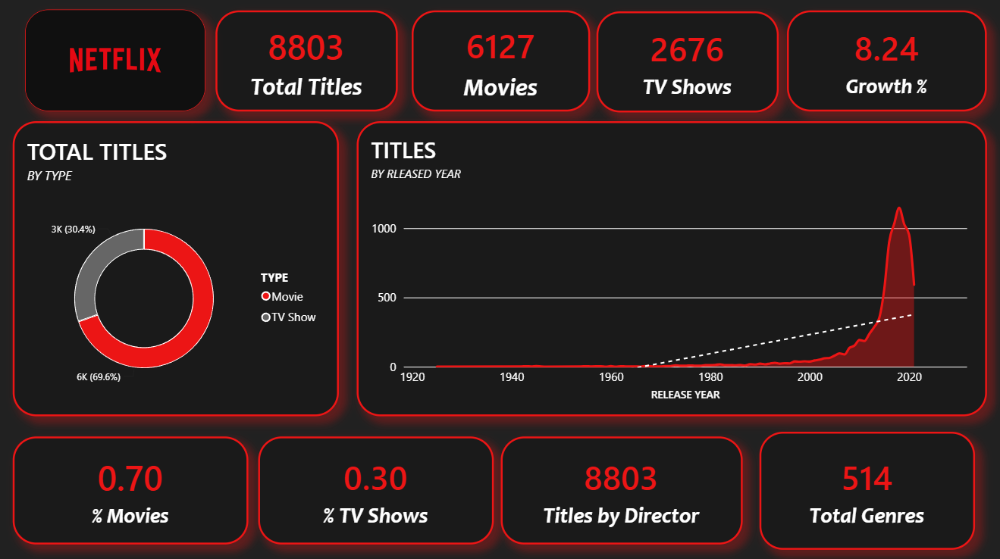
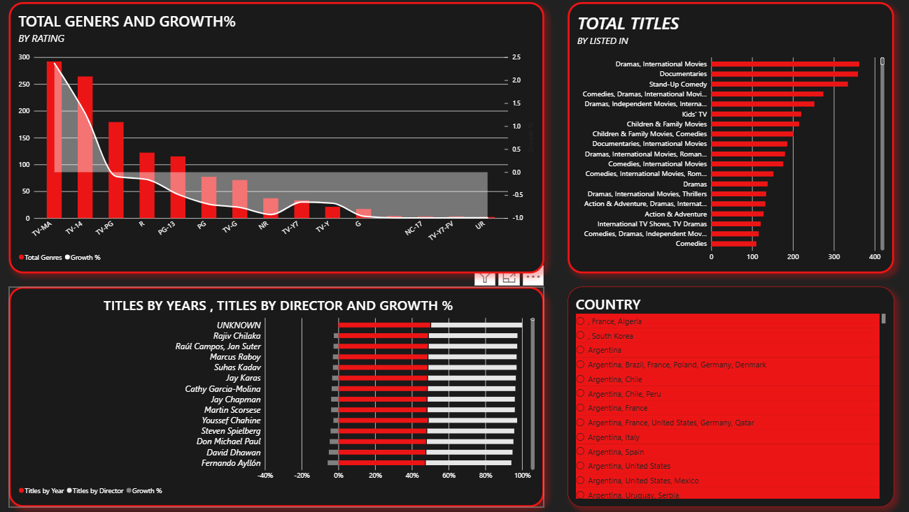
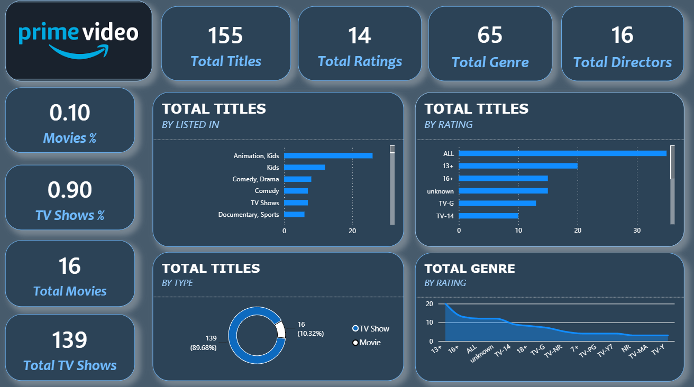
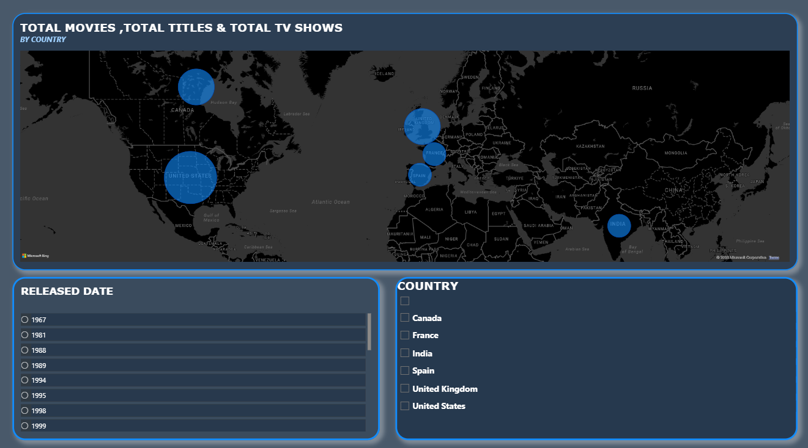
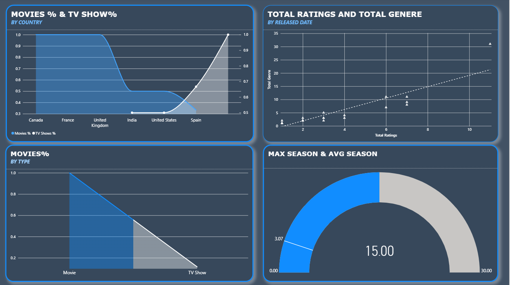

# 📊 Data Analytics Portfolio

Welcome to my Data Analytics portfolio.

This repository contains practical projects created using **Power BI, SQL, MySQL, DAX, and data visualization techniques**. The projects focus on transforming raw data into interactive dashboards and business-focused analysis.

---

## 📌 Projects

### 🎬 1. Netflix Data Analysis – Power BI

An interactive Power BI dashboard created to analyze Netflix's content library and explore trends across movies, TV shows, ratings, genres, directors, countries, and release years.

#### Key Analysis

- Total titles and content distribution
- Movies vs TV Shows
- Titles by release year
- Genre analysis
- Rating analysis
- Director analysis
- Country-wise content analysis
- Average movie duration
- Year and country filtering

#### Tools Used

- Power BI
- DAX
- Data Cleaning
- Data Modeling
- Data Visualization
- Interactive Slicers

#### Dashboard Screenshots

**Dashboard Overview**

**Genre & Director Analysis**

**Country & Rating Analysis**

**Power BI File:** `Netflix - PowerBI - Dashboard.pbix`

---

### 📺 2. Amazon Prime Video Data Analysis – Power BI

An interactive Power BI dashboard developed to analyze Amazon Prime Video content across countries, ratings, genres, directors, release dates, movies, and TV shows.

#### Key Analysis

- Total titles
- Total ratings
- Total genres
- Total directors
- Movies vs TV Shows
- Country-wise content analysis
- Rating analysis
- Genre analysis
- Release date analysis
- Season analysis

#### Tools Used

- Power BI
- DAX
- Data Cleaning
- Data Modeling
- Data Visualization
- Interactive Slicers

#### Dashboard Screenshots

**Dashboard Overview**

**Country Analysis**

**Ratings & Seasons Analysis**

**Power BI File:** `Amazon Prime - PowerBI - Dashboard.pbix`

---

### 🛒 3. E-Commerce Sales Analysis – MySQL

A SQL-based e-commerce analysis project focused on understanding sales, customers, products, orders, and business performance using relational data.

#### Key Analysis

- Sales performance
- Customer analysis
- Product performance
- Order analysis
- Revenue analysis
- Category analysis
- Customer purchasing patterns
- Business performance metrics

#### SQL Concepts Used

- SELECT
- WHERE
- ORDER BY
- GROUP BY
- HAVING
- JOIN
- INNER JOIN
- LEFT JOIN
- Aggregate Functions
- Subqueries

**SQL File:** `Ecommerce - Sales.sql`

---

## 🛠️ Technical Skills

| Category | Skills |
|---|---|
| Business Intelligence | Power BI, Dashboard Development, KPI Reporting |
| SQL | MySQL, Joins, Aggregations, Subqueries |
| Power BI | DAX, Data Modeling, Interactive Slicers |
| Data Analysis | Data Cleaning, Data Exploration, Business Analysis |
| Visualization | Charts, KPIs, Maps, Trend Analysis |
| Other Tools | Excel, Python, Tableau |

---

## 📈 What These Projects Demonstrate

- Data cleaning and preparation
- Exploratory data analysis
- SQL-based business analysis
- Power BI dashboard development
- DAX calculations
- Data modeling
- KPI development
- Interactive data visualization
- Business-focused reporting
- Communicating insights through dashboards

---

## 👨‍💻 About Me

Hi, I'm **Nandakumar**, an aspiring **Data Analyst** with a B.Com background and practical training in data analytics.

I have developed projects using **Power BI, SQL, Excel, Python, and Tableau**, with a focus on data visualization, reporting, and business analysis.

I am interested in using data to identify trends, generate insights, and support data-driven business decisions.

### Technical Skills

- Power BI
- SQL / MySQL
- Excel
- Python
- Tableau
- DAX
- Data Visualization
- Data Cleaning
- Business Analysis

---

## 📫 Connect With Me

**GitHub:**  
https://github.com/nandakumar10082005

---

⭐ Thank you for visiting my Data Analytics portfolio!
